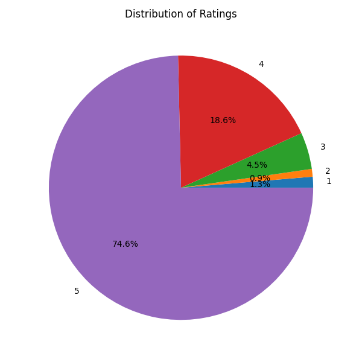
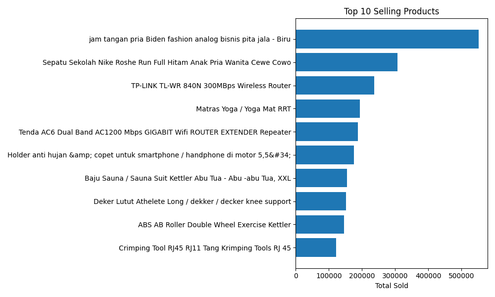
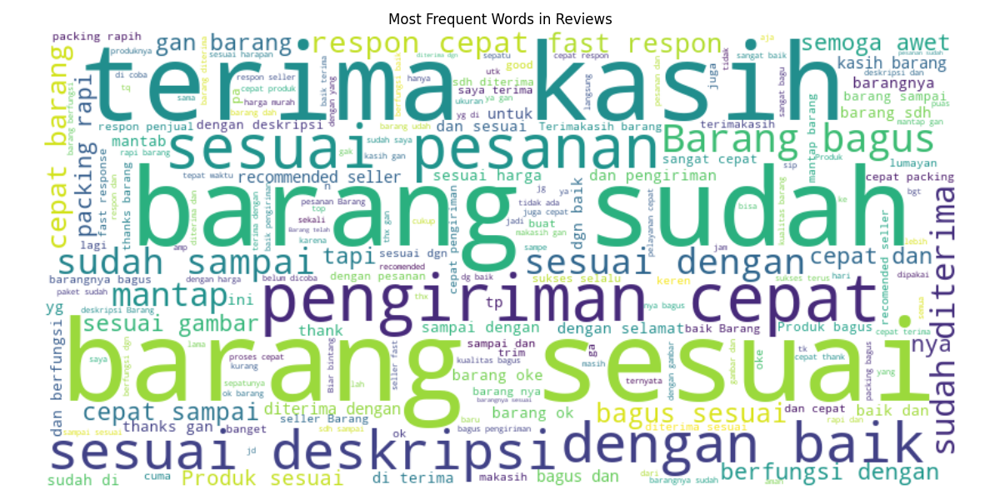

# Modular Automated E-commerce Review Data Pipeline for Business Insight

"A modular data pipeline that process raw review data from e-commerce into meaningful business insight through automated extraction, transformation, analysis, visualization, and saving"

This project demonstrates how raw data from marketplace can be transformed into business insight using modular data pipeline.
This project separates responsibilities into layers:
- Data extraction
- Data cleaning
- Business metric aggregation
- Insight generate
- Saving result
The design is reproducible and designed with scalability in mind.

## Overview
E-commerce platforms generate thousands of customer review daily. Making decision hard to do manually with only raw data. This project simulates how a Data Engineer builds system to convert those raw data into visualized insight for end-user.

## Pipeline Architecture
```
Extract -> Transform -> Analyze -> Visualize -> Saving
```
1. Extract
- Validates dataset path
- Load CSV
2. Transform
- Clean text field
- Enforce numeric typing
- Ensures structural consistency
3. Analyze
- Aggregate product-level metric such as total unit sold, average rating, review count
- Aggregate category-level metric
- Identifies most positive and most negative product
4. Visualize
- Visualize data with graph, bar, wordcloud
5. Saving
- Save output into csv and image

## Sample Output

Rating Distribution


Top 10 Selling Products


Review Wordcloud



## Project Structure
```
tokopedia-product-review-data-pipeline/
|-data/
   |-raw/
      |-tokopedia-product-reviews-2019.csv
|-output/
|-src/
   |-analysis.py
   |-extract.py
   |-load.py
   |-pipeline.py
   |-transform.py
   |-visualization.py
|-config.json
|-README.md
|-requirements.txt
```

## How to Run
(make sure to have the dataset and python installed before continue)
1. Install dependencies
```
pip install -r requirements.txt
```

2. Run the pipeline
```
python -m src.pipeline
```
or with custom config
```
python -m src.pipeline config_dev.json 
```

## Output
These files can be used for further analysis such as power BI, reporting tools, database, or manually by Internal Teams
Structured Data:
- cleaned_data.csv
- product_stats.csv
- category_stats.csv
- most_positive_product.csv
- most_negative_product.csv
Image:
- top_10_products.png
- worst_10_products.png
- rating_distribution.png
- category_avg_rating.png
- wordcloud.png

## Key Highlight
Moduler package architecture
Config driven execution
Separation of concerns per layer
Portable execution as module using python -m
Ready for database extension

## Tech Stack
- Python
- Libraries: Pandas, Matplotlib, Wordcloud
- Dataset source: (https://www.kaggle.com/datasets/farhan999/tokopedia-product-reviews/data)

## Closing
- This project demonstrates the ability to design structured data workflows
- Separate processing layers
- Build reusable and scalable pipelines
- Turn raw data into meaningful business insight
- Run localy

## Limitation
- Pipeline process not in real-time
- Local memory process
- Simple ranking logic, no advance scoring

## Future Improvement
- Add database
- Add unit testing
- Containerize using Docker
- Integrate scheduling
